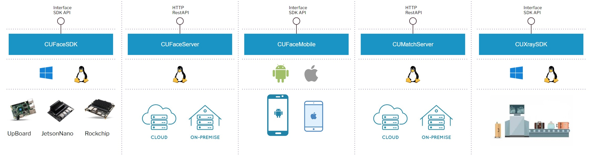

# Overview

DLite (Deep Learning Inference Toolkit for Edge)는,
얼굴을 감지하고 신원을 인식할 수 있는, 고성능, 고효율, 고가용한 AI 얼굴 인식 엔진을 제공하며,
얼굴 인식 응용 프로그램을 개발하거나, 얼굴 인식을 기존 시스템에 통합하거나, 또는 기존 시스템의 기능을 확장할 수 있는 인터페이스(API)를 제공합니다.

## 추론엔진
* CUFaceSDK: 에지 디바이스나, 데스크탑 환경에서의 추론 엔진
* CUFaceServer: 서버 환경에서의 CPU, GPU를 이용한 추론 엔진
* CUFaceMobile: 모바일 환경에서의 추론 엔진
* CUMatchServer: 신원 인증을 위한 얼굴 특징점을 고속 매칭하는 서버
* CUXraySDK: Xray 수화물 사진에서 위험물질 검출 추론 엔진

## 개념도

