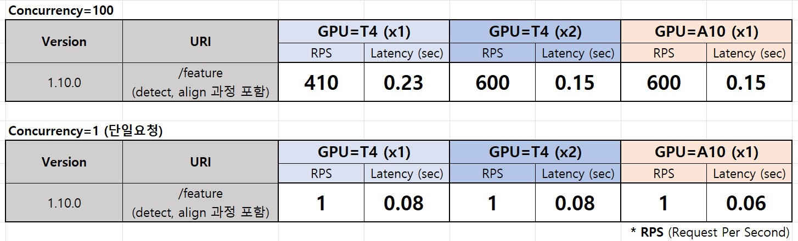
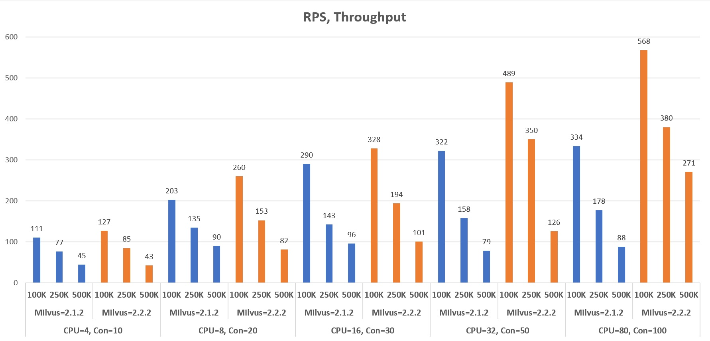

# Benchmark

## Inference (GPU)
```
Intel(R) Xeon(R) Gold 5218R CPU @ 2.10GHz
CPU Assign=32 (Inference=4, API=26, Prometheus=1, Grafana=1)
Concurrency=100
```

### Throughput
| Models | Version | URI | GPU=T4 | GPU=A10 | GPU=A30 |
|-|-|-|-|-|-|
| Face             | 1.9.0  | /detect            | 672 | 683   | 810   |
|                  |        | /feature-only      | 674 | 980   | 1,025 |
|                  |        | /feature (+detect) | 352 | 512   | 626   |
|                  | 1.10.0 | /detect            | 661 | 657   | 667   |
|                  |        | /feature-only      | 820 | 1,015 | 1,036 |
|                  |        | /feature (+detect) | 405 | 587   | 620   |

### Latency
* 얼굴을 포함하는 이미지로부터 특징점 추출 (전/후처리 포함)
  * Detect (320x320)
  * Align
  * Feature-Extraction (112x112)
* RPS (Request Per Second) = Throughput
  * 초당 특징점 추출 이미지 500건 이상 (A10 기준)
  * A10은, T4 대비 1.5배 가량 성능 우위
  * GPU 2개는, 1개 대비 1.5배 가량 성능 우위




## Inference (CPU)
```
Intel(R) Xeon(R) Gold 5218R CPU @ 2.10GHz
CPU Assign=32 (Inference=28, API=4)
Concurrency=50
```

| Models | Version | URI | RPS | Avg-Latency (ms) |
|-|-|-|-|-|
| Face | 1.0.4 | /detect            | 130 | 367 |
|      |       | /feature-only      | 78  | 615 |
|      |       | /feature (+detect) | 62  | 767 |

### Matching
```
* Intel(R) Xeon(R) Gold 5218R CPU @ 2.10GHz
* Gallery= 100K | 250K | 500K
* Concurrency=10~100
* URI=/search

* CPU Assignment (CPUs = 4|8|16|32|80)
1. CPUs= 4: (Milvus= 3, API=1)
2. CPUs= 8: (Milvus= 6, API=2)
3. CPUs=16: (Milvus=14, API=2)
4. CPUs=32: (Milvus=28, API=4)
5. CPUs=80: (Milvus=72, API=8)
```

